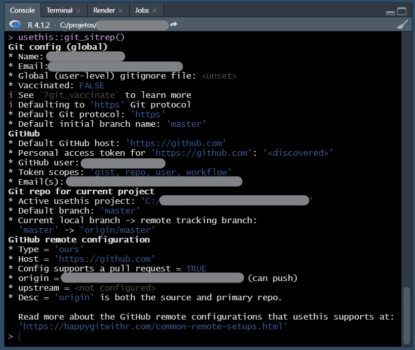
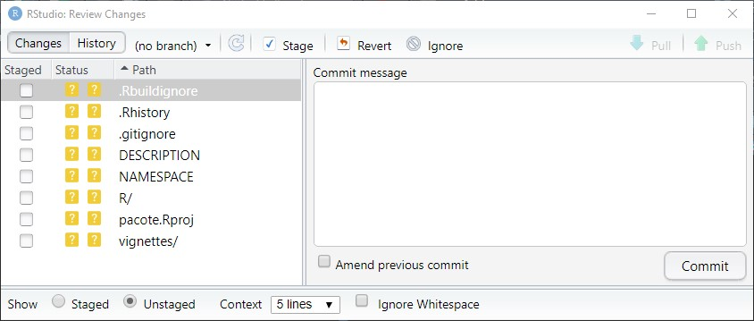

class: right, middle
```{r setup, include=FALSE}
options(htmltools.dir.version = FALSE)
knitr::opts_chunk$set(
  fig.width=9, fig.height=3.5, fig.retina=3,
  out.width = "100%",
  cache = FALSE,
  echo = TRUE,
  message = FALSE, 
  warning = FALSE,
  hiline = TRUE
)
```

```{r xaringan-themer, include=FALSE, warning=FALSE}
library(xaringanthemer)
style_mono_accent(
  base_color = "#23395b",
  header_background_auto = FALSE,
  header_font_google = google_font("helvetica"),
  text_font_google   = google_font("helvetica", "300", "300i"),
  code_font_google   = google_font("helvetica")
)
```

```{r xaringan-tile-view, echo=FALSE}
xaringanExtra::use_tile_view()
```
##“How many bricks would it take to make that nose?”<br>
_Dagny Holm, designer-chefe de modelos do Grupo LEGO até 1986_

---

class: header_background
# <br>
.left-column[]

.right-column[
## Sumário

1.  **Introdução**

1.  **Tutorial**

1.  **Conclusão**

1.  **Referências**
]

---

layout: true

# 1.Introdução

---

class: header_background

## Contextualização, motivação e abordagem

--
count: false

- Esta apresentação faz parte de um trabalho mais amplo intitulado: _"Inteligência Artificial Reprodutível: Redes Bayesianas"_
--
count: false

   - Criação de pacotes

   - Gerenciamento de dependências
  
   - Versionamento

--
count:false

- Estimular usuários de R a desenvolver seus próprios pacotes, compartilhá-los
em repositórios na internet e/ou submetê-los ao CRAN. Contribuindo para a comunidade
de usuários e desenvoledores de R.

--
count:false

- Tutorial: Do zero ao Github

---

class:header_background

##Questões importantes

--
count:false

- Por que criar pacotes?
--
count:false

  - Os pacotes são as unidades fundamentais do código R reproduzível.
  
  - Economizar tempo
  
  - Compartilhar código facilmente
  
---

class:header_background

##Questões importantes

- Por que gerenciar dependências?
--
count:false

   - Criar ambientes reproduzíveis para cada projeto tornando-os:
    
     - Isolados
    
     - Portáteis

     - Reprodutíveis
     
---

class:header_background

##Questões importantes

- Por que versionar?
--
count:false
  
  - Guardar o histórico de alterações
  
  - Especialmente importante em trabalhos colaborativos [Veja mais aqui]("https://beatrizmilz.github.io/slidesR/git_rstudio/11-2021-ENCE.html#51")
  
---

layout: true

# 2.Tutorial

---

class:header_background

## Pré requisitos

--
count:false

- [R](https://www.r-project.org/)
  
- [Rtools](https://cran.r-project.org/bin/windows/Rtools/rtools40.html)

- [RStudio](https://www.rstudio.com/)

- [Git](https://git-scm.com/)

- Criar conta no [Github](https://github.com/)

- devtools

- knitr

- rmarkdown

- renv

```{r eval=FALSE}
install.packages(c("devtools", "knitr", "rmarkdown", "renv")) # devtools instala ainda os pacotes usethis e roxygen2
```

---

class: header_background

## Fluxo de trabalho
<br>
<br>
<br>
<br>
--
count:false


---

class:header_background

## Passo a passo - Criar pacote
--
count:false
.pull-left[
- Iniciar o Rstudio

- Criar estrutura mínima do pacote
  ```{r eval=FALSE}
  # No console

  usethis::create_package("caminho do pacote")
  ```
  - *.gitignore*

  - *.Rbuildignore*

  - *DESCRIPTION*

  - *NAMESPACE*
  
  - */R*]

.pull-right[
<center></center>
]

---

class:header_background

## Passo a passo - Editar
--
count:false

- Arquivo DESCRIPTION

<center></center>

--
count:false

- Incluir licença
```{r eval=FALSE}
usethis::use_mit_license() # Licensa MIT

```

---

class:header_background

## Passo a passo - Editar

- Adicionar funções

```{r eval=FALSE}
# Cria e abre o arquivo /R/função.R

usethis::use_r("função")

```
--
count:false

- Editar função.R
--
count:false

  - Chamar funções explicitamente
--
count:false
  
  - Caso função.R utilize funções de outros pacotes
  
```{r eval=FALSE}

usethis::use_package("outra função") # Adiciona Imports: "outra função" ao aquivo DESCRIPTION

```
--
count:false
- Carregar função.R para verificar funcionamento

```{r eval=FALSE}

devtools::load_all() #ou o atalho <ctrl + shift + l>
```

---

class:header_background

## Passo a passo - Editar

- Criar estrutura mínima de documentação
--
count:false

  - Na barra de menu acessar *Code*>*Insert Roxygen Skeleton* ou o atalho *ctrl + shiht +alt + r*
--
count:false
  
  - Preencher título e campos @
  
<center></center>

---

class:header_background

## Passo a passo - Editar

- Gerar documentação
  ```{r eval=FALSE}

  devtools::documment() # ou o atalho <ctrl + shift + d>
  ```
  - */man*
  
  - */man/função.Rd*
--
count:false

- Checar pacote em busca de erros

```{r eval=FALSE}

devtools::check() # ou o atalho <ctrl + shift + l>

0 errors √ | 0 warnings √ | 0 notes √ # Retorno esperado


```

---

class:header_background

## Passo a passo - Editar

### Adicionar *vignettes*

*"Uma vignette é um guia de formato longo para o seu pacote (...) pode descrever o problema que seu pacote foi projetado para resolver e, em seguida, mostrar ao leitor como resolvê-lo"* (Wickham e Bryan)

```{r eval=FALSE}

browseVignettes() # Para vizualizar todas as vignettes instaladas

```
--
count:false
  - Criar *vignette*
    ```{r eval=FALSE}

    usethis::use_vigntte()

    ```
    - */vignette*
  
    - */vignette/função.Rmd*
    
    - Modifica DESCRIPTION
--
count:false
        - *Suggests: knitr, rmarkdown* e *VignetteBuilder: knitr, rmarkdown*

---

class:header_background

## Passo a passo - Editar

Arquivo *função.Rmd*

<center></center>
--
count:false

- *Crtl + Shift + k* para *knit* e visualizar vignette
--
count:false

- Executar *install* para instalar o pacote

```{r eval=FALSE}

devtools::install(build = TRUE, build_vignettes = TRUE) # Instalar pacote, criar arquivo e gerar vignette

```

---

class:header_background

## Passo a passo - Editar

Help!

```{r eval=FALSE}

help(package = "nome do pacote")

```
.pull-left[
<center></center>
]
.pull-rigth[
<center></center>
]

---

class:header_background

## Passo a passo - Gerenciar dependências
--
count:false

- Iniciar biblioteca local
  ```{r eval=FALSE}
  renv::init() # Reconhece as depedências utilizadas e cria o arquivo renv.lock
  ```
--
count:false
  - De maneira semelhante, utiliza-se renv::snapshot() quando já existe uma biblioteca local
  ```{r eval=FALSE}
  renv::snapshot() # Reconhece novas depedências utilizadas e adiciona ao arquivo renv.lock
  ```
--
count:false
  - Já de maneira oposta, renv::load() é utilizado para _carregar_ um estado anterior salvo em renv.lock
  ```{r eval=FALSE}
  renv::load() # Carrega dependências listadas no arquivo renv.lock
  ```
  
---

class:header_background

## Passo a passo - Versionamento (Git + Github)
--
count:false

- Configurar o Git
--
count:false

```{r eval=FALSE}
# Apresentar-se ao Git (Essa etapa pode ser feita apenas uma vez)

usethis::use_git_config(user.name = "nome do usuário", user.email = "contatol@email.com")

```
--
count:false
```{r eval=FALSE}
# Gerar token

usethis::create_github_token()

```
--
count:false
```{r eval=FALSE}
# Armazenar token

gitcreds::gitcreds_set()

# Aqui, reiniciar o R (ctrl + shift + f10)

```
--
count:false
```{r eval=FALSE}
# Checar se configuração funcionou

usethis::usethis::git_sitrep()

```

---

class:header_background

## Passo a passo - Versionamento (Git + Github)

Resultado do teste de configuração do Git

<center></center>

---

class:header_background

## Passo a passo - Versionamento (Git + Github)

- Inicializar repositório
```{r eval=FALSE}

usethis::use_git("Primeiro commit") # Cria repositório e realiza o commit inicial

```
--
count:false

- Enviar pacote para o Github

```{r eval=FALSE}

usethis::use_github()

```
--
count:false

<br>
<br>
<center><h2>Seu pacote está online!</h2></center>

---

class:header_background

## Passo a passo - Versionamento (Git + Github)

.pull-left[
- Cliente Git do Rstudio

  - Stage
  
  - Commit
  
  - Push
]

.pull-right[
<center></center>
<center></center>

]

---

class:header_background

## Passo a passo - Versionamento (Git + Github)

### Observações
--
count:false

- Sobre criação de pacote
--
count:false

  - Para clonar um projeto do Github

```{r eval=FALSE}
usethis::create_from_github("caminho Github", destdir = "caminho pasta", fork = TRUE)
```
--
count:false

- Sobre instalação de pacotes do Gibhub
--
count:false

  - Para instalar o pacote do Github

```{r eval=FALSE}

devtools::install_github("caminho repositório", build_vignettes = TRUE) # Instalar e criar vignettes

```
--
count:false

- Sobre desenvolvimento colaborativo utilizando Gibhub [clique aqui]("https://beatrizmilz.github.io/slidesR/git_rstudio/11-2021-ENCE.html#51")

---

layout: true

# 3.Conclusão

---

class:header_background

## Considerações finais

Embora o esforço para criar pacotes, gerenciar suas dependências e versioná-los
possa parecer considerável, analisadas as etapas do tutorial apresentado é possível
dizer que boa parte desse esforço pode já fazer parte da rotina de trabalho de muitos usuários de R.

Pacotes são *"(...) unidades fundamentais do código R reproduzível (...) incluem funções R reutilizáveis, a documentação que descreve como usá-las e dados de exemplo".* Dessa maneira, como é corrente o uso de funções nos scripts, principalmente para evitar repetições demasiadas -e conseguente confusão- dentro do código, ao mesmo tempo em que desenvolvedores mais "esquecidos" são generosos nas observações e anotações dentro seus scripts; não é exagero dizer que boa parte do trabalho para o desenvolvimento de pacotes já  está embutido -em maior ou menor medida- em projetos de usuários da comunidade.

Quanto ao gerenciamento de dependências e o versionamento, com rotinas simples e poucas linhas de comando
é possível ter um pacote que sempre vai funcionar, entregando o resultado esperado, independente de atualizações na biblioteca do R; da mesma maneira configurar um repositório online, para além de um backup com controle de versão ou disponibilização de uma nova ferramenta para a comunidade, pode ser uma ferramenta muito útil para o desenvolvimento colaborativo.

---

layout: true

# 4.Referências

---

class:header_background

1. [Slides Curso de pacotes (curso-r)](https://curso-r.github.io/main-pacotes/slides/index.html#1)

1. [R packages by Hadley Wickham and Jenny Bryan](https://r-pkgs.org/index.html)

1. [devtools RDocumentation](https://cran.r-project.org/web/packages/devtools/readme/README.html)

1. [roxygen2: In-Line Documentation for R](https://cran.r-project.org/web/packages/roxygen2/)

1. [Introdução à utilização do Git e GitHub no RStudio]("https://beatrizmilz.github.io/slidesR/git_rstudio/11-2021-ENCE.html#1)

1. [Happy Git and GitHub for the useR](https://happygitwithr.com/index.html)

1. [renv: Project Environments for R](https://www.rstudio.com/blog/renv-project-environments-for-r/)

1. [Kevin Ushey | renv: Project Environments for R | RStudio (2020)](https://www.youtube.com/watch?v=yjlEbIDevOs)

---

layout: false
class: center, middle

# Grato pela atenção!

Contato: gilsonll.contato@gmail.com

Slides created via the R packages:

[**xaringan**](https://github.com/yihui/xaringan) &
[**xaringanthemer**](https://github.com/gadenbuie/xaringanthemer)

The chakra comes from [remark.js](https://remarkjs.com), [**knitr**](http://yihui.name/knitr), and [R Markdown](https://rmarkdown.rstudio.com).